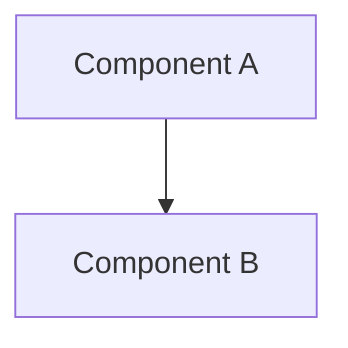

# AI Instructions — MusicApps Knowledge Base

This file configures AI tools (Claude Code, GitHub Copilot, etc.) working in this project.
It contains all preferences and technical details needed to write new articles without additional context.

---

## Project overview

This is the **MusicApps Knowledge Base** — a personal technical reference for the MusicApps project.

| Property | Value |
|---|---|
| Published at | https://kb.musicapps.eu |
| Source | https://github.com/musicapps-kek/musicapps-kb |
| Site generator | [Zensical](https://zensical.org) (MkDocs-based) |
| Author | Karl-Ernst Kiel |
| Language | English |

### Related projects

| Project | URL / Path |
|---|---|
| Development blog | https://blog.musicapps.eu — `/Volumes/externUSB/kekiel/projects/musicapps/musicapps-blog` |
| SessionClick app (Android) | `/Users/kekiel/AndroidStudioProjects/SessionClick` |
| Project notes (Obsidian) | `/Users/kekiel/Library/Mobile Documents/iCloud~md~obsidian/Documents/KEK/MusicApps` |

### Audience

These articles are written **for the project author**, not for a general public audience. The reader:
- Is an experienced developer with Android knowledge
- Is learning iOS and Kotlin Multiplatform as part of this project
- Wants concise, accurate technical reference — not tutorials or introductory hand-holding

---

## Writing style

- **Tone:** Direct and factual. No filler phrases ("It's worth noting that…", "As you can see…").
- **Length:** Concise. Short paragraphs. If something can be said in one sentence, use one sentence.
- **Article descriptions in prose:** Keep them short — one or two sentences per concept, not a full paragraph. Avoid restating what is already visible in the heading or code example.
- **Perspective:** First-person is acceptable but not required. When comparing Android vs iOS, always treat Android as the known baseline.
- **No fluff:** Do not add motivational language, do not over-explain obvious concepts, do not pad sections.
- **Headings:** Use sentence case (`## How it fits into a project`, not `## How It Fits Into A Project`).
- **Code examples:** Keep them minimal and directly relevant. Prefer real project code (from SessionClick) over invented examples where possible.

---

## Diagrams

**Always include Mermaid diagrams** when writing or updating articles. Do not wait to be asked.

### When to use which type

| Situation | Diagram type |
|---|---|
| Architecture layers / component overview | `graph TD` (top-down) |
| Data or control flow between components | `sequenceDiagram` |
| Decision logic / algorithm steps | `flowchart TD` |
| Timing comparisons, parallel processes | `gantt` |
| Simple linear pipeline | `graph LR` (left-right) |

### Syntax (Zensical/MkDocs)

Mermaid is enabled in this project via `pymdownx.superfences`. Use standard fenced code blocks:

````markdown

````

Diagrams render in:
- The built site (`zensical serve` / deployed)
- VS Code preview (requires `bierner.markdown-mermaid` extension)

### Diagram guidelines

- Add a short sentence before the diagram explaining what it shows.
- Keep node labels short — avoid wrapping text where possible.
- Use `<br/>` for line breaks inside node labels in `graph` diagrams.
- Edge labels (e.g. `-->|"text"|`) are encouraged for architecture diagrams to explain what flows between nodes.

---

## Reference links

**Always link** standard framework and API names to their official documentation on first mention in each article.

### Link targets by technology

| Technology | Documentation root |
|---|---|
| Android APIs (Java/Kotlin) | https://developer.android.com/reference |
| Jetpack Compose | https://developer.android.com/develop/ui/compose |
| Android guides (concepts) | https://developer.android.com/guide |
| Kotlin language | https://kotlinlang.org/docs |
| Kotlin coroutines / Flow | https://kotlinlang.org/docs/coroutines-overview.html |
| Kotlin Multiplatform | https://kotlinlang.org/docs/multiplatform.html |
| Oboe (audio) | https://google.github.io/oboe/ |
| Apple / SwiftUI / UIKit | https://developer.apple.com/documentation |
| Swift language | https://docs.swift.org/swift-book/documentation/the-swift-programming-language/ |
| Gradle | https://docs.gradle.org |

### Rules

- Link on **first mention per article**. Do not repeat the link on every subsequent mention.
- Link the backtick-formatted name, not surrounding prose: `` [`ViewModel`](url) ``, not `[the ViewModel](url)`.
- In tables, link the most important cell entries — don't link every cell if it makes the table unreadable.
- For long Android reference URLs (full method signatures), prefer the **guide or concept page** over the raw API reference when a good guide page exists (e.g. use `developer.android.com/develop/ui/compose/lists` instead of the full `LazyColumn` method signature URL).
- Do not link things inside code blocks — add a comment in the code or a prose link immediately before/after the block instead.

---

## Technical: Zensical and MkDocs

Zensical is an MkDocs distribution with the Material theme preconfigured. All standard MkDocs Material features are available.

### Enabled markdown extensions

| Extension | What it enables |
|---|---|
| `admonition` | `!!! note`, `!!! tip`, `!!! warning`, `!!! danger` blocks |
| `pymdownx.details` | Collapsible `??? note` blocks |
| `pymdownx.superfences` | Fenced code blocks including `mermaid` |
| `pymdownx.highlight` | Syntax highlighting with anchor line numbers |
| `pymdownx.inlinehilite` | Inline code highlighting |
| `pymdownx.tabbed` | Tabbed content blocks |
| `toc` | Auto table of contents with `permalink: true` |

### Admonition syntax

```markdown
!!! note "Optional custom title"
    Content goes here, indented by 4 spaces.

!!! tip
    A tip — no custom title, uses default.

??? warning "Collapsible"
    This block is collapsed by default (uses `???` instead of `!!!`).
```

Available types: `note`, `tip`, `info`, `warning`, `danger`, `success`, `question`, `bug`, `example`, `quote`.

### Tabbed content syntax

```markdown
=== "Android"
    Android-specific content here.

=== "iOS"
    iOS-specific content here.
```

Useful for side-by-side Android/iOS code comparisons.

### Code blocks

Syntax highlighting is enabled for all common languages. Specify the language after the opening fence:

````markdown
```kotlin
val bpm = 120
```

```swift
let bpm = 120
```

```cpp
int bpm = 120;
```

```cmake
target_link_libraries(audio-engine oboe::oboe)
```
````

### No frontmatter required

Zensical does not use YAML frontmatter. The page title comes from the `# H1` heading at the top of the file.

---

## Adding a new article

1. Create a `.md` file in the appropriate subfolder under `docs/`
2. Add it to the `nav:` section in `mkdocs.yml`
3. Use a `# H1` heading as the page title
4. Follow the writing style and diagram/link rules above

### Current nav structure

```
docs/
├── index.md
├── kmp/
│   ├── what-is-kmp.md
│   ├── gradle-in-kmp.md
│   └── kotlin-and-ios.md
├── android/
│   ├── android-vs-ios-concepts.md
│   ├── oboe-audio-framework.md
│   └── sessionclick-architecture.md
└── tools/
    └── index.md
```

When creating an article, choose the most appropriate existing subfolder. If none fits, discuss with the author before creating a new one — each new subfolder becomes a top-level nav section.

### mkdocs.yml nav entry format

```yaml
nav:
  - Section Name:
      - Article Title: folder/filename.md
```

---

## SessionClick project reference

Key facts about the app being documented, for use when writing articles:

| Property | Value |
|---|---|
| App name | SessionClick |
| Platform | Android (iOS planned) |
| Language | Kotlin (Compose Multiplatform), C++ (audio engine) |
| Architecture | KMP — `shared` module + `composeApp` (Android) + `iosApp` (iOS, pending) |
| Audio engine | Oboe 1.10.0 via JNI — `AudioEngine.cpp` |
| Min SDK | 28 (Android 9) |
| Target SDK | 36 |
| NDK version | 28.2.13676358 |
| Package | `eu.musicapps.sessionclick` |
| App source | `/Users/kekiel/AndroidStudioProjects/SessionClick` |

### Key source files

| File | Purpose |
|---|---|
| `composeApp/src/androidMain/cpp/AudioEngine.cpp` | Native Oboe audio engine |
| `composeApp/src/androidMain/kotlin/.../audio/AndroidAudioEngine.kt` | Kotlin JNI wrapper |
| `composeApp/src/androidMain/kotlin/.../audio/AudioEngineViewModel.kt` | ViewModel (state + service binding) |
| `composeApp/src/androidMain/kotlin/.../audio/MetronomeService.kt` | Foreground service |
| `composeApp/src/androidMain/kotlin/.../App.kt` | Compose UI root |
| `shared/src/commonMain/kotlin/.../audio/AudioEngine.kt` | Platform-agnostic interface |
