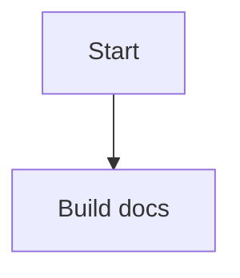

# MusicApps Knowledge Base

Technical reference for the [MusicApps](https://musicapps.eu) project — documenting the architecture, tools, and concepts behind building [SessionClick](https://sessionclick.com) and future apps.

Published at: **[kb.musicapps.eu](https://kb.musicapps.eu)**

## About this project

This KB is a personal reference, not a polished product. Articles are written to help the author remember and understand the technical background of the project — things like how Kotlin Multiplatform works, how Gradle fits in, and how Android and iOS concepts compare.

Built with [Zensical](https://zensical.org), deployed to GitHub Pages via GitHub Actions.

---

## Writing articles

Articles are plain Markdown files in the `docs/` folder. The structure mirrors the navigation in `mkdocs.yml`.

### Folder structure

```
docs/
├── index.md                        ← KB home page
├── kmp/                            ← Kotlin Multiplatform articles
├── android/                        ← Android & iOS articles
└── tools/                          ← Dev tools & AI agents
```

### Adding a new article

1. Create a `.md` file in the appropriate subfolder, e.g. `docs/kmp/my-topic.md`
2. Add it to the `nav:` section in `mkdocs.yml`
3. Write in standard Markdown — see existing articles for style reference

### Frontmatter

Zensical does not require frontmatter, but you can add a `# H1 heading` at the top of each file as the page title.

---

## Preview locally

```bash
# Install Zensical (once)
pipx install zensical

# Start local dev server
zensical serve
```

Open [http://127.0.0.1:8000](http://127.0.0.1:8000) — the site reloads automatically on file changes.

---

## Mermaid diagrams

Mermaid code fences are enabled in this project.

Use standard fenced blocks in Markdown:

````markdown

````

````

Notes:

- Site rendering (Zensical/MkDocs): Mermaid is loaded via `mkdocs.yml`, so diagrams render in the built site and local `zensical serve` output.
- VS Code editor preview: install the recommended workspace extension (`bierner.markdown-mermaid`) from `.vscode/extensions.json`.

---

## Publish

Push to the `main` branch. GitHub Actions builds and deploys automatically.

```bash
git add .
git commit -m "Add/update article: <topic>"
git push
````

Deployment takes ~1 minute. Published at [kb.musicapps.eu](https://kb.musicapps.eu).

---

## Reference

- [Zensical documentation](https://zensical.org)
- [MusicApps blog](https://blog.musicapps.eu)
- [GitHub organisation](https://github.com/musicapps-kek)
