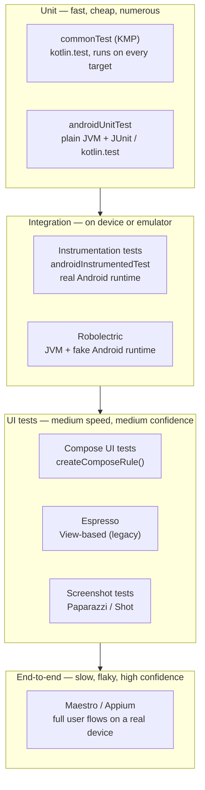
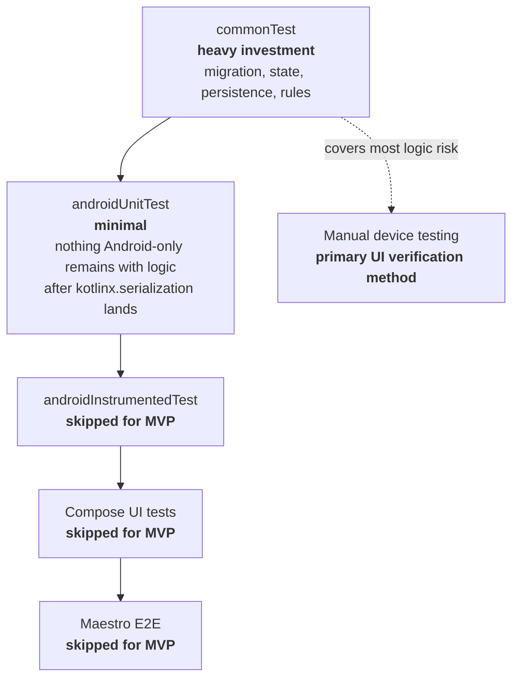

# Android testing — types, trade-offs, and the SessionClick plan

Android development has several distinct test types, each with different speed/fidelity/cost profiles. This article catalogues what exists, what each type is for, and — concretely — what SessionClick uses today and what it deliberately defers.

## The test pyramid

A healthy test suite has many fast unit tests at the base and few slow end-to-end tests at the top. Inverting this is a classic pathology: suites take hours and still miss logic bugs.



## Unit tests (JVM-local)

Location in a plain Android project: `src/test/`. In a [KMP](https://kotlinlang.org/docs/multiplatform.html) project: `src/commonTest/` for platform-agnostic logic, `src/androidUnitTest/` for Android-only JVM tests.

- **Runtime:** plain JVM on the developer's machine. No emulator, no Android runtime.
- **Speed:** milliseconds per test.
- **Tools:** [`kotlin.test`](https://kotlinlang.org/api/latest/kotlin.test/) (multiplatform), [JUnit 4 / 5](https://junit.org/junit5/) (Android-only), [Kotest](https://kotest.io/), [Turbine](https://github.com/cashapp/turbine) for [`Flow`](https://kotlinlang.org/docs/flow.html) and coroutines, [MockK](https://mockk.io/) or hand-rolled fakes for test doubles.
- **Good for:** pure functions, domain logic, data transformations, validation, migration, state machines.
- **Bad for:** anything touching [`Context`](https://developer.android.com/reference/android/content/Context), real [Room](https://developer.android.com/training/data-storage/room) databases, the Android SDK, or the Compose runtime.

## Instrumentation tests

Location: `src/androidTest/` or `src/androidInstrumentedTest/` in KMP.

- **Runtime:** real Android runtime on a device or emulator.
- **Speed:** seconds per test, plus a ~30-second emulator boot cost per run.
- **Tools:** [AndroidX Test](https://developer.android.com/training/testing), `ActivityScenario`, `ServiceTestRule`, Room's in-memory database helper.
- **Good for:** Room DAOs, [SharedPreferences](https://developer.android.com/training/data-storage/shared-preferences), [Service](https://developer.android.com/reference/android/app/Service) lifecycle, [WorkManager](https://developer.android.com/topic/libraries/architecture/workmanager) — anything that genuinely needs the SDK.
- **Bad for:** pure logic (wasteful — use unit tests).

## Robolectric

[Robolectric](http://robolectric.org/) runs on the JVM but provides a fake Android runtime — fake `Context`, `Resources`, `Activity` lifecycle. Faster than the emulator (seconds, not minutes of boot) but the fake sometimes diverges from real Android, masking bugs or producing false positives.

Use case: needs Android SDK access without emulator boot cost, and the fidelity trade-off is acceptable. Modern Android projects tend to avoid Robolectric for anything safety-critical and use real instrumentation tests instead.

## Compose UI tests

Location: `src/androidInstrumentedTest/` — needs a device or emulator.

[Compose UI testing](https://developer.android.com/develop/ui/compose/testing) uses `createComposeRule()` plus matchers like `onNodeWithText`, `onNodeWithTag`, and actions like `performClick`, `assertIsDisplayed`. Tests render a single composable or screen in isolation and verify rendering and interaction.

- **Cost:** much faster than [Espresso](https://developer.android.com/training/testing/espresso) but still instrumented. Maintenance burden is real — UIs change often.
- **Good for:** critical flows (authentication, payment, checkout).
- **Bad for:** everything. Many small teams skip these entirely and rely on screenshot tests or manual QA.

## Espresso

[Espresso](https://developer.android.com/training/testing/espresso) is the classic Android UI testing framework for View-based UI. Largely superseded by Compose UI tests for greenfield projects. Mentioned here for context — encountered in older codebases.

## Screenshot tests

[Paparazzi](https://github.com/cashapp/paparazzi) (runs on JVM, no emulator) or [Shot](https://github.com/pedrovgs/Shot). Renders a composable, saves a PNG, diffs against a reference PNG committed to the repo.

- **Catches:** unintentional visual changes (font weight, spacing, colours).
- **Trade-off:** deliberate UI changes require regenerating screenshots. Noisy on a fast-moving UI.
- **Sweet spot:** after the design stabilizes, for a handful of key screens.

## End-to-end tests

[Maestro](https://maestro.mobile.dev/) (YAML flows, simple, widely adopted in 2025–2026) or [Appium](https://appium.io/) (more powerful, more complex). Scripts a full user journey on a real device.

- **High cost:** slow runs, flakiness when animations or timing vary, device farm required at scale.
- **High value** for release-gate smoke tests and reproducing customer-reported bugs.

## KMP specifics

In a Kotlin Multiplatform project, tests live in source sets that mirror the production source sets:

| Source set | Runs on | Typical content |
|---|---|---|
| `commonTest` | every target (JVM, iOS, etc.) | Pure logic with zero platform dependencies. **Highest-ROI test location.** |
| `androidUnitTest` | Android JVM | Android-only logic that doesn't need the SDK (rare if `commonTest` is used well). |
| `androidInstrumentedTest` | Android device / emulator | Real Android SDK usage: Room, Service, etc. |
| `iosTest` | iOS simulator | iOS-specific logic. |

Every test in `commonTest` runs automatically on every platform the project targets. Write once, cover Android and iOS simultaneously. This is the reason to aggressively keep domain logic in `shared/commonMain` — the tests follow for free.

## The SessionClick plan

### What is in use

**Heavy investment in `commonTest`:**

- `MigrationTest.kt` — v1 → v2 schema migration (six cases: dedup across playlists, case/whitespace normalization, BPM-as-identity, special-item passthrough, empty input).
- `SessionStateTest.kt` — 14 tests covering `selectedIndex` arithmetic across `removeItem` / `moveItem` / `restoreItem`, cascade delete from the song pool, cross-playlist propagation via pool references, bulk-operation notification semantics.
- `FakeAudioEngine` — a test double implementing the [`AudioEngine`](../android/sessionclick-architecture.md#native-audio-layer) interface. Available for verifying ViewModel ↔ engine interaction without real audio hardware.

These run on Android and iOS targets. See [Gradle test commands](#running-the-tests) below.

### What is deliberately skipped

| Test type | Reason |
|---|---|
| `androidInstrumentedTest` | After the `SessionState` extraction, `SessionViewModel` is a thin Compose adapter with no domain logic of its own. `MetronomeService` is small and stable — easier to verify by running the app. Revisit if the Service grows. |
| Compose UI tests | High maintenance cost for a UI still changing weekly. Reconsider before 1.0 release for critical flows (Start / Stop, BPM display). |
| Screenshot tests | UI still shifting — screenshot regeneration would be constant noise. Revisit once the design stabilizes, around beta. |
| Maestro / E2E | Setup cost not justified at this stage. A smoke test for "add song → start → stop" becomes worthwhile before 1.0 release. |
| Audio timing | Frame-accurate scheduling cannot be unit-tested — the clock is real hardware. Verified empirically on device: ø 0.15 ms / max 0.26 ms jitter at 120 BPM. |

### Pyramid, SessionClick-shaped



Solid = actively used. Dashed = deliberately deferred. Manual device testing is a first-class verification method for a small solo project with rapid UI churn.

## Running the tests

All commands run from the project root (`/Users/kekiel/AndroidStudioProjects/SessionClick`).

=== "All multiplatform tests"
    ```bash
    ./gradlew :shared:allTests
    ```
    Runs `commonTest` on every configured target (JVM, iOS simulator, etc.).

=== "Android JVM only"
    ```bash
    ./gradlew :shared:testDebugUnitTest
    ./gradlew :composeApp:testDebugUnitTest
    ```

=== "Instrumented"
    ```bash
    ./gradlew :composeApp:connectedAndroidTest
    ```
    Requires a device or emulator running.

Reports are written to `build/reports/tests/` as HTML.

## When to revisit this plan

Trigger points for adding more test types:

- **Before 1.0 release** — add a Maestro smoke test covering the golden path (open app → add song → start metronome → stop → close). Catches release-blocking regressions.
- **After a production bug** — write the test that would have caught it, regardless of which layer it belongs to. The pyramid grows organically through reality, not speculation.
- **When a collaborator joins** — UI tests become more valuable when the UI isn't in one developer's head.
- **Before a large Compose refactor** — snapshot-test the affected screens first so visual changes are detectable.

## Related articles

- [SessionClick App Architecture](sessionclick-architecture.md) — component layout and responsibilities
- [What is Kotlin Multiplatform?](../kmp/what-is-kmp.md) — source sets, `expect` / `actual`, shared-code mechanics
