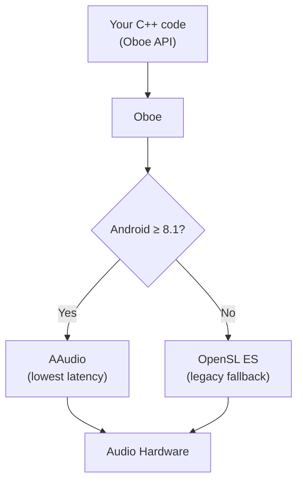
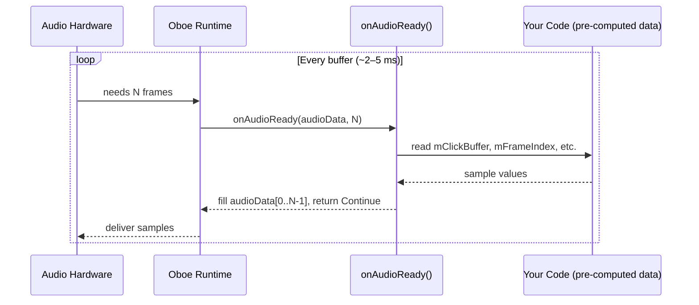
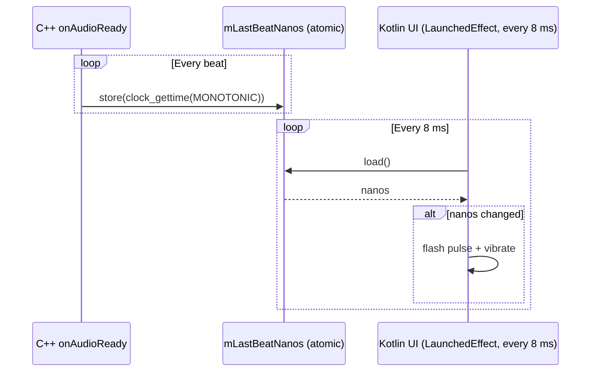

# Oboe Audio Framework

[Oboe](https://github.com/google/oboe) is a C++ library from Google that gives Android apps low-latency, high-performance audio. It is the recommended way to implement professional-grade audio — such as a metronome — on Android.

## Why Oboe?

Android has had audio APIs for a long time, but they evolved in inconsistent ways across API levels and device manufacturers. Oboe solves two problems at once:

**1. Automatic API selection**
Oboe internally uses [AAudio](https://developer.android.com/ndk/guides/audio/aaudio/aaudio) on Android 8.1 (API 27) and above. On older devices it falls back to [OpenSL ES](https://developer.android.com/ndk/guides/audio/opensl/opensl-for-android). You write your code once; Oboe picks the best available engine at runtime.



**2. Low-latency configuration**
Getting truly low-latency audio on Android requires a specific combination of settings (exclusive mode, the device's native sample rate, the correct buffer size). Oboe exposes these through a clean builder API and handles the device-specific quirks behind the scenes.

## Core concepts

### AudioStreamBuilder

[`AudioStreamBuilder`](https://google.github.io/oboe/reference/classoboe_1_1_audio_stream_builder.html) is the entry point. You chain configuration calls on it and then call `openStream()`:

```cpp
AudioStreamBuilder builder;
builder.setPerformanceMode(PerformanceMode::LowLatency)
       ->setSharingMode(SharingMode::Exclusive)
       ->setFormat(AudioFormat::Float)
       ->setChannelCount(ChannelCount::Mono)
       ->setDataCallback(this)
       ->setErrorCallback(this);

Result result = builder.openStream(mStream);
```

| Setting | What it does |
|---|---|
| `LowLatency` | Requests the smallest possible buffer size from the OS |
| `Exclusive` | Stream gets direct hardware access, not mixed with other apps |
| `Float` | Samples are 32-bit floats in the range −1.0 to +1.0 |
| `Mono` | Single channel output |

### The data callback

Instead of writing to a buffer yourself, you implement [`AudioStreamDataCallback::onAudioReady`](https://google.github.io/oboe/reference/classoboe_1_1_audio_stream_data_callback.html). Oboe calls this method from a high-priority audio thread whenever the hardware needs more samples:

```cpp
DataCallbackResult onAudioReady(AudioStream *audioStream,
                                void *audioData,
                                int32_t numFrames) override {
    float *output = static_cast<float *>(audioData);
    // fill output[0..numFrames-1] with samples
    return DataCallbackResult::Continue;
}
```

This callback runs on a dedicated thread that the OS schedules with elevated priority. **You must never block it** — no mutexes, no memory allocation, no I/O. All heavy work (loading samples, calculating buffers) happens before `start()` is called.



### Error handling

[`AudioStreamErrorCallback::onErrorAfterClose`](https://google.github.io/oboe/reference/classoboe_1_1_audio_stream_error_callback.html) is called when the stream is closed unexpectedly — for example when the user unplugs headphones. You restart the stream here so audio switches to the new output device automatically:

```cpp
void onErrorAfterClose(AudioStream *stream, Result error) override {
    mStream.reset();
    start();  // reopen on the new device
}
```

### Sample rate

Always let Oboe use the device's native sample rate. Never hardcode 44100 or 48000. After opening the stream, read it back:

```cpp
mSampleRate = mStream->getSampleRate();
```

Using the native rate avoids an internal resampler, which is a major source of added latency.

## Why Oboe for a metronome?

A metronome has one critical requirement: the interval between clicks must not vary. Standard Java/Kotlin threading (e.g. [`Handler.postDelayed`](https://developer.android.com/reference/android/os/Handler#postDelayed(java.lang.Runnable,long))) is subject to OS scheduler jitter — the thread can be delayed by tens of milliseconds on a loaded device, producing an audible tempo variation.

Oboe solves this by making timing a *counting problem* instead of a *scheduling problem*. The audio callback fires with a fixed block of frames. By counting frames inside the callback, the beat falls at exactly the right sample — immune to scheduler jitter, because the timing is embedded in the audio data itself.

```mermaid
gantt
    title Timer-based vs Frame-counting (120 BPM, beat every 500 ms)
    dateFormat x
    axisFormat %Lms

    section Timer-based (jittery)
    Beat 1        :b1, 0, 10
    OS delay      :crit, d1, 500, 540
    Beat 2 (late) :b2, 540, 10
    OS delay      :crit, d2, 1000, 1010
    Beat 3 (ok)   :b3, 1010, 10

    section Frame-counting (exact)
    Beat 1        :c1, 0, 10
    Beat 2        :c2, 500, 10
    Beat 3        :c3, 1000, 10
```



## How Oboe is used in SessionClick

### Build setup

Oboe is added as an Android dependency in `composeApp/build.gradle.kts`:

```kotlin
implementation(libs.oboe)
```

The native library is compiled with CMake (`composeApp/src/androidMain/cpp/CMakeLists.txt`):

```cmake
find_package(oboe REQUIRED CONFIG)

add_library(audio-engine SHARED AudioEngine.cpp)

target_link_libraries(audio-engine oboe::oboe log)
```

### C++ audio engine

`AudioEngine.cpp` contains a class that extends both [`AudioStreamDataCallback`](https://google.github.io/oboe/reference/classoboe_1_1_audio_stream_data_callback.html) and [`AudioStreamErrorCallback`](https://google.github.io/oboe/reference/classoboe_1_1_audio_stream_error_callback.html). The stream is opened with `LowLatency + Exclusive` mode at the device's native sample rate.

**Click generation**

The click sound is a short 880 Hz sine wave with a fast exponential decay, pre-computed once into `mClickBuffer`:

```cpp
void generateClick() {
    const float frequency = 880.0f;
    const float durationSeconds = 0.015f;  // 15 ms
    const int32_t numFrames = static_cast<int32_t>(durationSeconds * mSampleRate);
    mClickBuffer.resize(numFrames);

    for (int i = 0; i < numFrames; ++i) {
        float time = static_cast<float>(i) / mSampleRate;
        float envelope = expf(-i * 10.0f / numFrames);
        mClickBuffer[i] = sinf(2.0f * M_PI * frequency * time) * envelope * 0.5f;
    }
}
```

**Frame-accurate beat timing**

Inside `onAudioReady`, a frame counter increments every sample. When it reaches `framesPerBeat`, a new beat begins:

```cpp
DataCallbackResult onAudioReady(AudioStream *audioStream,
                                void *audioData,
                                int32_t numFrames) override {
    float *output = static_cast<float *>(audioData);

    for (int i = 0; i < numFrames; ++i) {
        if (mFrameIndex >= mFramesPerBeat) {
            mFrameIndex = 0;
            mClickFrameIndex = 0;

            // Capture hardware timestamp for UI sync
            struct timespec ts;
            clock_gettime(CLOCK_MONOTONIC, &ts);
            mLastBeatNanos.store(
                static_cast<int64_t>(ts.tv_sec) * 1000000000LL + ts.tv_nsec
            );

            // Update BPM at the boundary (no mid-beat glitch)
            calculateFramesPerBeat();
        }

        float sample = 0;
        if (mClickFrameIndex < mClickBuffer.size()) {
            sample = mClickBuffer[mClickFrameIndex++];
        }

        output[i] = sample;
        mFrameIndex++;
    }

    return DataCallbackResult::Continue;
}
```

`framesPerBeat` is simply:

```cpp
mFramesPerBeat = mSampleRate * 60 / mBpm.load();
```

At 48 000 Hz and 120 BPM that is 24 000 frames — exactly half a second. BPM changes take effect at the *next* beat boundary, so there is never a partial beat.

**Beat timestamps for UI sync**

`mLastBeatNanos` is a `std::atomic<int64_t>`. The Kotlin UI layer polls it every 8 ms. When the value changes, a new beat just fired and the UI can flash or vibrate in sync with the audio — without any independent timer that could drift.



### Kotlin wrapper and JNI bridge

`AndroidAudioEngine.kt` is a thin Kotlin class that loads the native library and maps each method to a [JNI](https://developer.android.com/training/articles/perf-jni) call:

```kotlin
companion object {
    init {
        System.loadLibrary("audio-engine")  // matches add_library() in CMakeLists.txt
    }
}

private external fun nativeStart(bpm: Int)
private external fun nativeStop()
private external fun nativeSetBpm(bpm: Int)
private external fun nativeRelease()
external fun nativeGetLastBeatNanos(): Long
```

All Kotlin-level validation (BPM range check, guard against double-start) happens here before the call crosses into native code.
