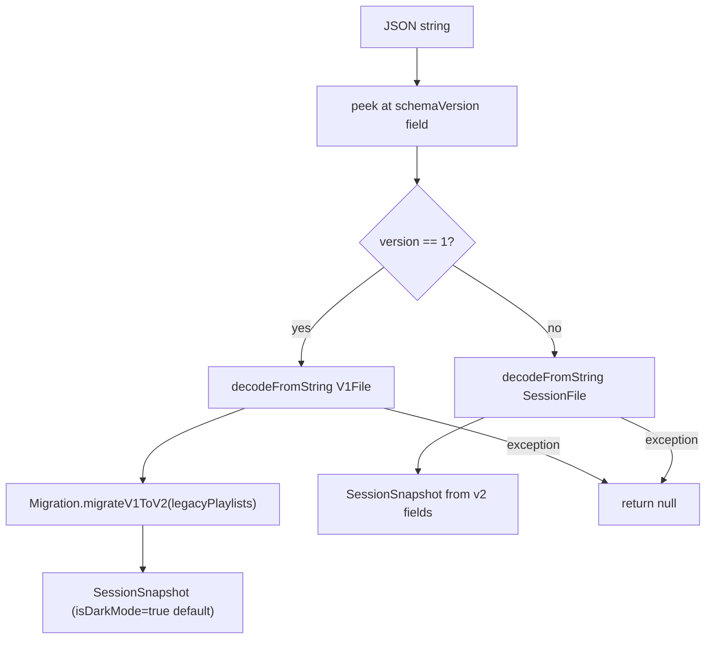

# Session Repository & Persistence

This article explains how SessionClick persists session data: how `session.json` is written and read, how the serialization layer is structured, and why the design is split the way it is.

## The problem it solves

Session data (songs, playlists, selected index, dark mode preference) must survive process death and be restorable on next launch. The Android-first implementation used `org.json` directly in `SessionViewModel` — Android-only, not reusable on iOS. The refactor moved all serialization into `shared/commonMain` so the iOS app can reuse it without changes.

The three responsibilities that were separated:

| Concern | Where it lives |
|---|---|
| What to serialize (data structure, schema) | `SessionRepository` in `commonMain` |
| How to access the file system | `FileStorage` interface in `commonMain` + `AndroidFileStorage` in `androidMain` |
| When to save and what to save | `SessionViewModel` in `androidMain` |

## FileStorage interface

```kotlin
interface FileStorage {
    fun read(filename: String): String?
    fun write(filename: String, text: String)
}
```

The interface is in `shared/commonMain`. `AndroidFileStorage` (in `shared/androidMain`) implements it:

```kotlin
class AndroidFileStorage(private val filesDir: File) : FileStorage {
    override fun read(filename: String): String? =
        File(filesDir, filename).takeIf { it.exists() }?.readText()

    override fun write(filename: String, text: String) {
        File(filesDir, filename).writeText(text)
    }
}
```

`SessionRepository` depends only on the interface, never on `AndroidFileStorage` directly. When the iOS app is built, `IosFileStorage` in `shared/iosMain` will provide the iOS equivalent and `SessionRepository` will work without modification.

`SessionViewModel` wires them together at construction time:

```kotlin
private val repository = SessionRepository(
    AndroidFileStorage(getApplication<Application>().filesDir)
)
```

## SessionSnapshot

`SessionSnapshot` is the public data class that `SessionRepository` accepts and returns. It represents a complete point-in-time snapshot of session state:

```kotlin
data class SessionSnapshot(
    val songs: List<Song>,
    val playlists: List<Playlist>,
    val activePlaylistId: String,
    val selectedIndex: Int = 0,
    val isDarkMode: Boolean = true
)
```

`SessionViewModel` builds a `SessionSnapshot` from `SessionState` every time `onChange` fires, then passes it to `repository.save()`. On startup, `repository.load()` returns a `SessionSnapshot` (or `null`) and the ViewModel calls `state.replaceAll(...)` to restore it.

## SessionRepository

`SessionRepository` owns serialization. It uses [kotlinx.serialization](https://github.com/Kotlin/kotlinx.serialization) and two private data classes as its JSON representation:

```kotlin
@Serializable
private data class SessionFile(     // schema v2 — what is written to disk
    val schemaVersion: Int,
    val activePlaylistId: String,
    val selectedIndex: Int = 0,
    val songs: List<Song>,
    val playlists: List<Playlist>,
    val isDarkMode: Boolean = true
)

@Serializable
private data class V1File(          // legacy format — only used for migration reads
    val schemaVersion: Int = 1,
    val playlists: List<LegacyPlaylist>
)
```

These are internal; callers only ever see `SessionSnapshot`.

### encode and decode

```kotlin
fun encode(snapshot: SessionSnapshot): String
fun decode(text: String): SessionSnapshot?
```

`encode` builds a `SessionFile` and serializes it to a JSON string using `Json.encodeToString`. `schemaVersion` is always written as `2` — explicitly, not as a default, so it is always present in the output.

`decode` first peeks at `schemaVersion` from the raw JSON without full parsing, then branches:



`runCatching` wraps the entire parse path — if anything throws (corrupt file, unexpected schema), `null` is returned and the caller falls back to the seed state.

The `Json` instance is configured with `ignoreUnknownKeys = true` so future schema additions don't break older app versions reading a newer file.

### save and load

```kotlin
fun save(snapshot: SessionSnapshot)
fun load(): SessionSnapshot?
```

`save` calls `encode` then `storage.write("session.json", ...)`. `load` calls `storage.read("session.json")` and passes the result to `decode`. If the file does not exist, `storage.read` returns `null` and `load` returns `null`.

## JSON schema v2

The current on-disk format:

```json
{
  "schemaVersion": 2,
  "activePlaylistId": "playlist-uuid",
  "selectedIndex": 2,
  "isDarkMode": true,
  "songs": [
    { "id": "song-abc123", "title": "Autumn Leaves", "subtitle": "Jazz standard", "bpm": 112, "lastEdited": 1713600000000 }
  ],
  "playlists": [
    {
      "id": "playlist-uuid",
      "name": "My Setlist",
      "items": [
        { "type": "songRef", "id": "ref-uuid-1", "songId": "song-abc123" },
        { "type": "special", "id": "ref-uuid-2", "label": "Pause" }
      ]
    }
  ]
}
```

**Field notes:**

- `selectedIndex` was added in v2. Absent in v1 files; defaults to `0` after migration.
- `isDarkMode` was added in v2. Absent in v1 files; defaults to `true` after migration.
- `lastEdited` is a Unix timestamp in milliseconds.
- `PlaylistItem` uses a `type` discriminator (`"songRef"` or `"special"`) for polymorphic deserialization.

## V1 → V2 migration

V1 playlists stored song data inline — each playlist item was a full song object, not a reference. The same song appearing in two playlists was stored twice with no shared identity.

`Migration.migrateV1ToV2(legacyPlaylists)` converts this:

1. Scans all items across all playlists, deduplicates songs by `title.trim().lowercase() + "|" + bpm`.
2. Assigns stable pool IDs to deduplicated songs.
3. Replaces inline song items with `SongRef` items pointing to the pool.
4. Returns a `MigrationResult` with a `songs: List<Song>` pool and updated `playlists: List<Playlist>`.

The migration is a pure function with no side effects. It is tested in `commonTest/MigrationTest.kt`.

When `decode` encounters a v1 file, it runs migration and returns the resulting `SessionSnapshot`. `SessionViewModel` then calls `state.replaceAll(...)`, and the next `onChange` fires (because `replaceAll` mutates state), which triggers `repository.save(...)` — so the file is immediately rewritten in v2 format. The device will never see v1 again after first launch on a v2 build.

## Where session data is stored

`session.json` is written to [`filesDir`](https://developer.android.com/reference/android/content/Context#getFilesDir()) — the app's private internal storage. This location:

- Is not accessible to other apps or the user via file manager.
- Is backed up automatically by [Android Auto Backup](https://developer.android.com/identity/data/autobackup) (unless opted out).
- Is removed when the app is uninstalled.

The user-facing export/import feature (`exportJson` / `importSnapshot` on `SessionViewModel`) uses the same `SessionRepository.encode()` and `decode()` to produce or consume a portable JSON file that the user controls.

## Related articles

- [SessionClick App Architecture](sessionclick-architecture.md) — how `SessionRepository` fits into the overall component diagram
- [What is Kotlin Multiplatform?](../kmp/what-is-kmp.md) — source sets, `expect` / `actual`, shared-code mechanics
