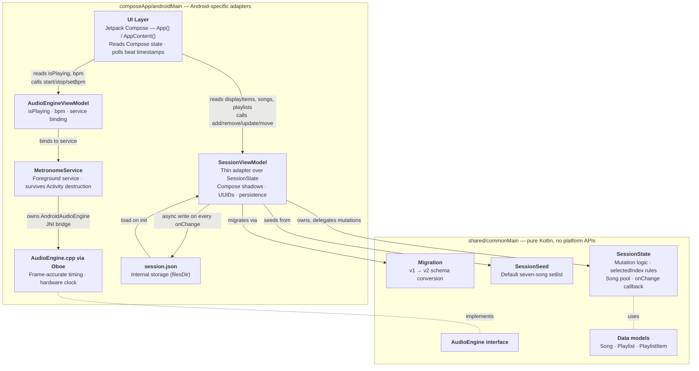
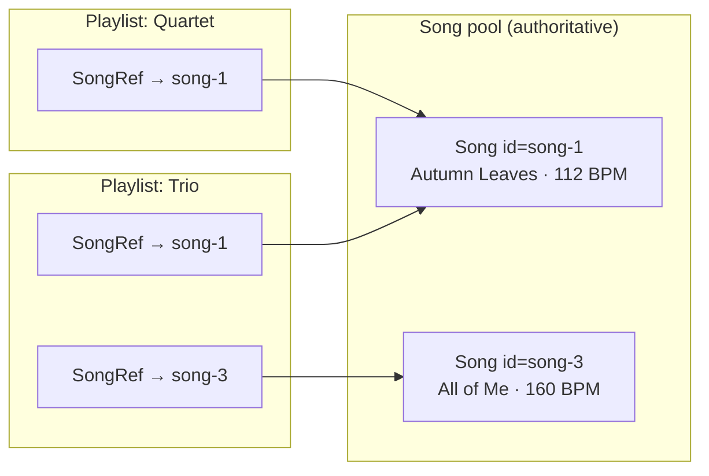
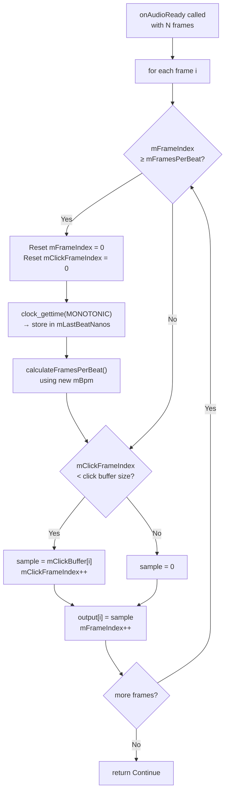
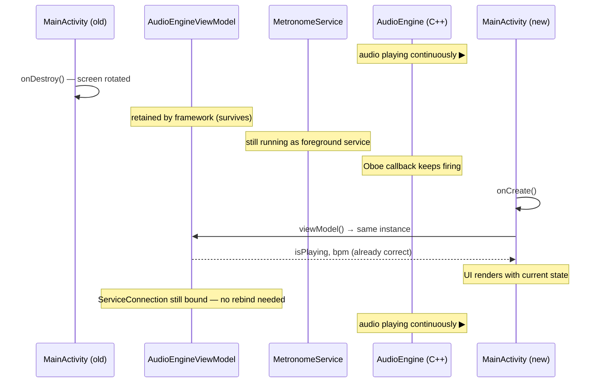

# SessionClick App Architecture

This article explains how SessionClick is structured: which components exist, what data each one holds, how audio timing is kept constant, how the app survives screen rotation, and how the architecture is split between a shared [Kotlin Multiplatform](https://kotlinlang.org/docs/multiplatform.html) module and Android-specific code.

## Overview

The app follows the **Single Activity + Compose** pattern. There are no fragments. The entire UI is [Jetpack Compose](https://developer.android.com/jetpack/compose). State management, persistence, and audio playback are separated into distinct layers so that each can evolve independently and survive lifecycle events.

The data layer is split across two modules. Pure domain logic (mutations, validation, the song pool model, schema migration) lives in `shared/commonMain` and will be reused by the iOS app. Android-specific concerns (Compose-observable state, UUID generation, file I/O, Service binding) live in `composeApp/androidMain`.



## Shared KMP layer (`shared/commonMain`)

### Data models

Three [`data class`](https://kotlinlang.org/docs/data-classes.html) types form the session data model:

- `Song` — a song in the central pool. Fields: `id`, `title`, `subtitle`, `bpm`, `lastEdited`.
- `PlaylistItem` — a sealed class with two variants:
    - `SongRef(id, songId)` — a lightweight reference from a playlist to a pool song. `id` is the per-instance ID (stable across drag, swipe, reorder); `songId` is the pool lookup key.
    - `Special(id, label)` — a stage direction like "Pause" or "Speaker intro". Inline only; not shared across playlists.
- `Playlist` — `id`, `name`, and `items: List<PlaylistItem>`.

### Song pool data model

Playlists do not own their songs. They hold references.



**Why this matters:**

- **Edits propagate.** Updating "Autumn Leaves" to 120 BPM from either playlist updates the single pool entry — both setlists show the new BPM on the next render. No sync code; it falls out of single source of truth.
- **No accidental duplication.** Adding the same song to three setlists stores it once.
- **Cascade delete.** Removing a song from the pool removes every `SongRef` to it across every playlist.

The trade-off: a song has one canonical BPM. If the user wants "Autumn Leaves at 112 in one setlist, 140 in another," they create two pool entries. This is the MVP decision and matches how streaming apps treat a track.

### SessionState

`SessionState` is the domain class. It has **zero** dependencies on Android, Compose, UUIDs, timestamps, or I/O — callers must supply IDs and lastEdited values. This determinism is what lets it be tested exhaustively and reused on iOS.

**Fields:**

| Field | Type | Purpose |
|---|---|---|
| `songs` | `List<Song>` | The pool (read-only view over a mutable list) |
| `playlists` | `List<Playlist>` | All playlists |
| `activePlaylistId` | `String` | Which playlist is currently active |
| `selectedIndex` | `Int` | Which item in the active playlist is selected |
| `items` | `List<PlaylistItem>` | Convenience: items of the active playlist |
| `onChange` | `(() -> Unit)?` | Callback fired after every mutation |

**Mutation operations:**

- Item operations: `selectItem`, `addItem`, `addItems` (bulk, single notification), `removeItem`, `restoreItem`, `updateItem`, `moveItem`.
- Playlist operations: `switchPlaylist`, `createPlaylist` (auto-switches to the new one), `deletePlaylist` (refuses if only one remains).
- Pool operations: `addSong`, `createSongAndAdd` (adds pool entry and inserts `SongRef`), `updateSong`, `deleteSongFromPool` (cascade — removes pool entry and every reference in every playlist).
- Bulk load: `replaceAll` (used after loading JSON on startup).

Every mutation fires `onChange` exactly once, including bulk operations. No-ops (unknown IDs, same-index moves) do not fire.

The `selectedIndex` arithmetic during `removeItem`, `moveItem`, and `restoreItem` is the subtlest part of the class and is covered by 14 tests in `commonTest/SessionStateTest.kt`. See [Android Testing](android-testing.md) for the test strategy.

### SessionSeed

Provides the default session state on first install: seven seeded songs and one playlist "My Setlist" containing six `SongRef`s and two `Special` entries. IDs are stable (`song-1` … `song-7`, `item-1` … `item-8`) so they can be referenced in tests.

### Migration

`Migration.migrateV1ToV2(legacyPlaylists)` is a pure function that converts the old inline-song format to the pool + reference format. Dedup key: `title.trim().lowercase() + "|" + bpm`. Preserves per-instance IDs from the legacy data. Called from `SessionViewModel.loadIfExists()` when a device has a pre-pool `session.json` file. Has its own tests in `commonTest/MigrationTest.kt`.

### AudioEngine interface

Defined in `shared/commonMain/audio/AudioEngine.kt`. Platform-agnostic contract with documented timing guarantees and BPM range (20–300). Android implementation is `AndroidAudioEngine`; iOS will provide its own behind the same interface.

## Android layer (`composeApp/androidMain`)

### MainActivity

`MainActivity` is the single entry point. Its only responsibilities are:

- Setting [`FLAG_KEEP_SCREEN_ON`](https://developer.android.com/reference/android/view/WindowManager.LayoutParams#FLAG_KEEP_SCREEN_ON) so the display stays on while the metronome runs
- Enabling edge-to-edge UI
- Calling `setContent { App() }` to hand off everything to Compose

It holds no data of its own. When it is destroyed (screen rotation, back press), no state is lost because all state lives in layers below it.

### SessionViewModel

`SessionViewModel` extends [`AndroidViewModel`](https://developer.android.com/reference/androidx/lifecycle/AndroidViewModel) (it needs `filesDir` for persistence). It is a thin adapter over `SessionState` — it does not own any domain logic. Its job is to:

- Hold a `SessionState` instance as the source of truth.
- Maintain [Compose-observable](https://developer.android.com/develop/ui/compose/state) shadows of the state's fields so the UI can recompose when they change.
- Generate Android-specific values (UUIDs via `java.util.UUID`, timestamps via `System.currentTimeMillis()`) and pass them into `SessionState` mutations.
- Subscribe to `state.onChange` to trigger Compose sync and async persistence on every mutation.

**What it holds:**

| Field | Type | Purpose |
|---|---|---|
| `state` | `SessionState` | Domain source of truth (private) |
| `_items` | `SnapshotStateList<PlaylistItem>` | Compose shadow of `state.items` |
| `_songs` | `SnapshotStateList<Song>` | Compose shadow of `state.songs` |
| `_playlists` | `SnapshotStateList<Playlist>` | Compose shadow of `state.playlists` |
| `activePlaylistId` | `String` (Compose state) | Which playlist is active |
| `selectedIndex` | `Int` (Compose state) | Which item is selected |
| `displayItems` | `List<DisplayItem>` (computed) | Resolves each `SongRef` to its pool `Song` for rendering |

`DisplayItem` is a sealed class with `SongView(instanceId, song)` and `SpecialView(instanceId, label)` variants. The UI iterates `displayItems` instead of raw `items` so it never has to perform pool lookups itself.

**The sync loop:**

```kotlin
init {
    state.onChange = {
        syncFromState()  // copies state fields into Compose shadows
        saveAsync()      // writes JSON to filesDir
    }
    loadIfExists()       // triggers state.replaceAll(...) if a session.json exists
    syncFromState()      // runs once in case no file existed
}
```

Every public mutation method on the ViewModel is a one-liner that delegates to `state`. UUID/timestamp-generating methods (`createPlaylist`, `createSongAndAdd`, `updateSong`) build the required values on the Android side before delegating.

**Persistence:**

`session.json` lives in `filesDir`. Schema v2 format:

```json
{
  "schemaVersion": 2,
  "activePlaylistId": "...",
  "songs": [ { "id", "title", "subtitle", "bpm", "lastEdited" }, ... ],
  "playlists": [
    {
      "id", "name",
      "items": [
        { "type": "songRef", "id": "...", "songId": "..." },
        { "type": "special",  "id": "...", "label": "..." }
      ]
    }
  ]
}
```

On init, `loadIfExists()` reads the file. If `schemaVersion` is absent or 1, it parses the legacy format, calls `Migration.migrateV1ToV2`, and writes v2 back immediately. If the file is missing or unparseable, `SessionSeed.defaultState()` is used as the fallback.

Serialization uses Android's built-in [`org.json`](https://developer.android.com/reference/org/json/JSONObject). This is Android-only; a planned refactor will replace it with [`kotlinx.serialization`](https://kotlinlang.org/docs/serialization.html) and `expect`/`actual` file I/O so persistence can move into `shared/commonMain` for iOS.

### AudioEngineViewModel

`AudioEngineViewModel` extends `AndroidViewModel`, which means the Android framework keeps exactly one instance alive across configuration changes such as screen rotation. It is responsible for audio state only — session data is handled separately by `SessionViewModel`.

**What it holds:**

| Field | Type | Purpose |
|---|---|---|
| `isPlaying` | `Boolean` (Compose state) | Whether the metronome is currently running |
| `_bpm` | `Int` (Compose state) | The current tempo |
| `metronomeService` | `MetronomeService?` | Reference to the bound service |
| `connection` | [`ServiceConnection`](https://developer.android.com/reference/android/content/ServiceConnection) | Manages the service binding lifecycle |

**What it does NOT hold:** the audio engine itself. The ViewModel only holds the binder reference to the service. This is intentional — the ViewModel lives as long as the UI component, but audio should keep running even when the app goes to the background.

**Service binding:**

The ViewModel starts and binds to `MetronomeService` in its `init` block using `application.startService()` + `application.bindService()`. Starting the service explicitly (rather than relying only on binding) keeps it alive after the ViewModel unbinds on app close, until `stopService()` is explicitly called.

When `onCleared()` is called (the ViewModel is finally destroyed because the user left the app), the service connection is unbound but the service continues running.

### MetronomeService

`MetronomeService` is a [foreground service](https://developer.android.com/develop/background-work/services/foreground-services). It runs independently of the Activity lifecycle and survives screen rotation, app backgrounding, and brief process interruptions.

**What it holds:**

| Field | Type | Purpose |
|---|---|---|
| `engine` | `AndroidAudioEngine` | The native audio engine, instantiated here |
| `binder` | `MetronomeBinder` | IPC handle returned to the ViewModel |

**Why a foreground service?**

Android can kill background services when memory is low. A *foreground* service is protected from this and must display a persistent notification to the user. `MetronomeService` shows a notification with the current BPM whenever the metronome is playing.

When `startMetronome(bpm)` is called, the service calls [`startForeground()`](https://developer.android.com/reference/android/app/Service#startForeground(int,android.app.Notification)) with a [`FOREGROUND_SERVICE_TYPE_MEDIA_PLAYBACK`](https://developer.android.com/reference/android/content/pm/ServiceInfo#FOREGROUND_SERVICE_TYPE_MEDIA_PLAYBACK) flag (API 29+). When `stopMetronome()` is called, it removes the notification with [`stopForeground(STOP_FOREGROUND_REMOVE)`](https://developer.android.com/reference/android/app/Service#stopForeground(int)).

### AndroidAudioEngine (JNI wrapper)

`AndroidAudioEngine` is a thin Kotlin class that owns the lifecycle of the native library. It loads `audio-engine.so` in its companion object `init` block and delegates all operations to JNI functions. It implements the `AudioEngine` interface from `shared/commonMain`.

**What it holds:** nothing except `isPlaying: Boolean` (a guard to prevent double-start). All real state is in the C++ object.

### AudioEngine.cpp (native)

This is where the audio lives. The C++ `AudioEngine` class extends Oboe's `AudioStreamDataCallback` and `AudioStreamErrorCallback`. It is instantiated as a static pointer (`engine`) in the JNI file and lives for the duration of the service.

**What it holds:**

| Field | Type | Purpose |
|---|---|---|
| `mStream` | `shared_ptr<AudioStream>` | The active Oboe audio stream |
| `mBpm` | `std::atomic<int>` | Current BPM, written from Kotlin, read in callback |
| `mSampleRate` | `int32_t` | Device native sample rate (read from stream after open) |
| `mClickBuffer` | `std::vector<float>` | Pre-computed click sound (880 Hz, 15 ms) |
| `mFrameIndex` | `int64_t` | Counts audio frames since last beat |
| `mFramesPerBeat` | `int64_t` | How many frames equal one beat at current BPM |
| `mLastBeatNanos` | `std::atomic<int64_t>` | Hardware timestamp of most recent beat |

## How timing stays constant

The metronome's accuracy comes from counting audio frames, not from OS timers.

**The problem with timers:** [`Handler.postDelayed`](https://developer.android.com/reference/android/os/Handler#postDelayed(java.lang.Runnable,long)), `coroutineScope`, and similar scheduling mechanisms are subject to OS scheduler jitter. On a loaded device, a scheduled callback can be delayed by 20–50 ms, producing a clearly audible rhythm variation.

**The solution:** frame counting inside the Oboe callback. The callback fires once per audio buffer (typically every 2–5 ms). Inside it, `mFrameIndex` increments by 1 for every audio sample rendered. When `mFrameIndex >= mFramesPerBeat`, a new beat starts. The formula:

```
framesPerBeat = sampleRate × 60 / BPM
```

At 48 000 Hz and 120 BPM: `48000 × 60 / 120 = 24000 frames` = exactly 0.5 seconds.

Because the timing is encoded in the audio stream itself, it is perfectly stable. The OS cannot "delay" a beat — the click samples are already in the buffer.

**BPM changes at beat boundaries:** When the user changes the tempo, `mBpm` is updated atomically. The new `framesPerBeat` is not calculated until the *next* beat boundary. This means there is never a partial or shortened beat — the current beat always completes at its original length.



## How the UI stays in sync

Once the metronome is running, the UI needs to flash and vibrate on each beat. It does this by *polling the C++ timestamp* rather than running its own independent timer.

In `App.kt`, a [`LaunchedEffect`](https://developer.android.com/reference/kotlin/androidx/compose/runtime/package-summary#LaunchedEffect(kotlin.Any,kotlin.coroutines.SuspendFunction1)) polls `getLastBeatNanos()` every 8 ms:

```kotlin
LaunchedEffect(isPlaying) {
    if (!isPlaying) return@LaunchedEffect
    var lastNanos = 0L
    while (true) {
        val nanos = getLastBeatNanos()
        if (nanos != lastNanos) {
            lastNanos = nanos
            // New beat — trigger pulse animation and vibration
            pulseAlpha.snapTo(1f)
            // ... animate fade
        }
        delay(8)
    }
}
```

`mLastBeatNanos` is written in the C++ callback using `clock_gettime(CLOCK_MONOTONIC)` at the exact sample where the beat starts. Because the UI reads the same timestamp, the visual flash and haptic feedback are always in phase with the audio. There is no separate timer that could drift out of sync.

## What survives screen rotation

Screen rotation destroys and recreates `MainActivity`. Here is what each layer does:

| Layer | Survives rotation? | Why |
|---|---|---|
| `MainActivity` | No — recreated | Normal Android lifecycle |
| Compose UI state (scroll position) | Yes — [`rememberLazyListState`](https://developer.android.com/reference/kotlin/androidx/compose/foundation/lazy/package-summary#rememberLazyListState(kotlin.Int,kotlin.Int)) | Compose saves state across recompositions |
| `AudioEngineViewModel` | Yes | `AndroidViewModel` is retained by the framework |
| `isPlaying`, `bpm` | Yes | Held in `AudioEngineViewModel` as Compose state |
| `SessionViewModel` | Yes | `AndroidViewModel` is retained by the framework |
| `SessionState` | Yes | Held inside `SessionViewModel` |
| Song pool, playlists, `selectedIndex` | Yes | All live in `SessionState`, shadowed into Compose state |
| `MetronomeService` | Yes | Runs independently, bound service reconnects automatically |
| Audio playback | Yes — uninterrupted | The service continues running while rotation happens |
| Native `AudioEngine` | Yes | Owned by the service, never destroyed during rotation |

**Reconnection flow on rotation:**

1. Old `MainActivity` is destroyed. The ViewModel's `ServiceConnection` still exists (ViewModel survived).
2. New `MainActivity` is created. Compose calls `viewModel()` and gets the *same* ViewModel instance.
3. The `ServiceConnection` is already bound — `metronomeService` reference is still valid.
4. The UI reads `isPlaying` and `bpm` from the ViewModel and renders correctly.
5. Audio has been playing continuously throughout steps 1–4.



## What does NOT survive process death

If Android kills the process entirely (rare, but possible under extreme memory pressure), the following is lost:

- `AudioEngineViewModel` state (`isPlaying`, `bpm`)
- `MetronomeService` and therefore audio playback
- Any in-flight UI state (open sheets, dialogs)

The following **is** restored on relaunch:

- Entire `SessionState` — song pool, playlists, special entries, active playlist — read from `session.json` by `SessionViewModel.loadIfExists()` on init
- If the stored file is schema v1, it is migrated to v2 and rewritten silently

On relaunch the metronome is stopped and the app is in its initial visual state, but all user data is intact.

## Related articles

- [Android Testing](android-testing.md) — how `SessionState` and `Migration` are tested in `commonTest`
- [What is Kotlin Multiplatform?](../kmp/what-is-kmp.md) — source sets, `expect` / `actual`, shared-code mechanics
