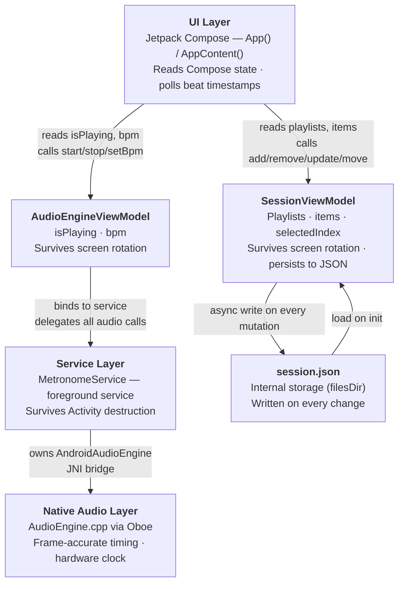
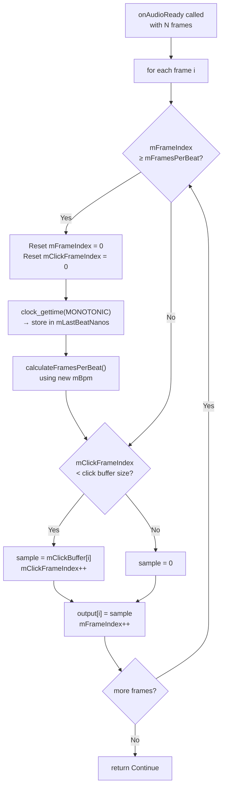
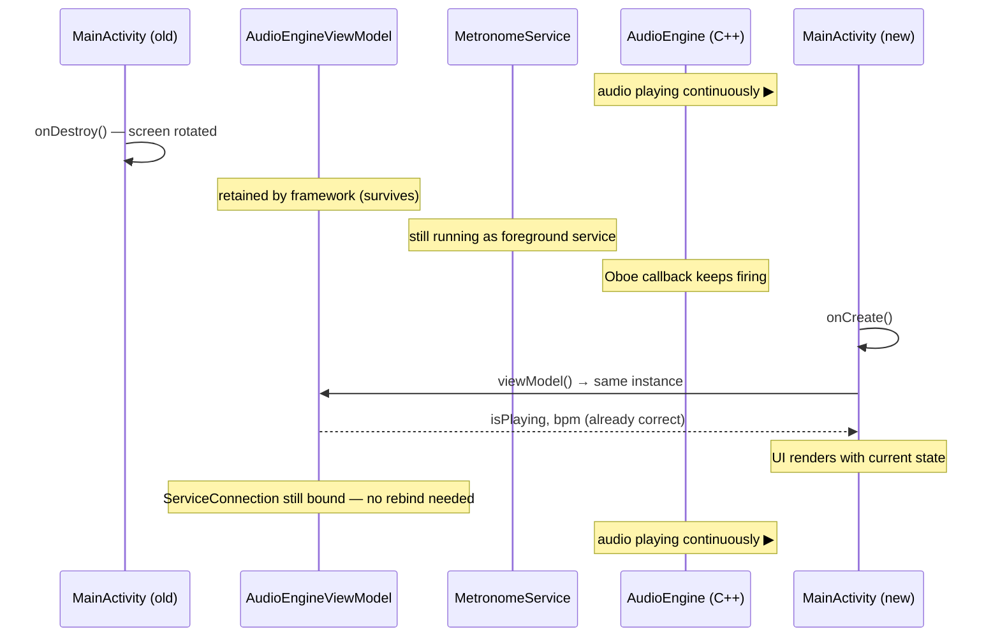

# SessionClick Android App Architecture

This article explains how the SessionClick Android app is structured: which components exist, what data each one holds, how audio timing is kept constant, and how the app survives events like screen rotation.

## Overview

The app follows the **Single Activity + Compose** pattern. There are no fragments. The entire UI is [Jetpack Compose](https://developer.android.com/jetpack/compose). State management and audio playback are separated into distinct layers so that each can survive lifecycle events independently.



## Components

### MainActivity

`MainActivity` is the single entry point. Its only responsibilities are:

- Setting [`FLAG_KEEP_SCREEN_ON`](https://developer.android.com/reference/android/view/WindowManager.LayoutParams#FLAG_KEEP_SCREEN_ON) so the display stays on while the metronome runs
- Enabling edge-to-edge UI
- Calling `setContent { App() }` to hand off everything to Compose

It holds no data of its own. When it is destroyed (screen rotation, back press), no state is lost because all state lives in layers below it.

### AudioEngineViewModel

`AudioEngineViewModel` extends [`AndroidViewModel`](https://developer.android.com/reference/androidx/lifecycle/AndroidViewModel), which means the Android framework keeps exactly one instance of it alive across configuration changes such as screen rotation. It is responsible for audio state only — playlist data is handled separately by `SessionViewModel`. When `MainActivity` is recreated, Compose calls `viewModel()` and gets back the *same* instance.

**What it holds:**

| Field | Type | Purpose |
|---|---|---|
| `isPlaying` | `Boolean` (Compose state) | Whether the metronome is currently running |
| `_bpm` | `Int` (Compose state) | The current tempo |
| `metronomeService` | `MetronomeService?` | Reference to the bound service |
| `connection` | [`ServiceConnection`](https://developer.android.com/reference/android/content/ServiceConnection) | Manages the service binding lifecycle |

**What it does NOT hold:** the audio engine itself. The ViewModel only holds the *binder reference* to the service. This is intentional — the ViewModel lives as long as the UI component, but audio should keep running even when the app goes to the background.

**Service binding:**

The ViewModel starts and binds to `MetronomeService` in its `init` block using `application.startService()` + `application.bindService()`. Starting the service explicitly (rather than relying only on binding) keeps it alive after the ViewModel unbinds on app close, until `stopService()` is explicitly called.

When `onCleared()` is called (the ViewModel is finally destroyed because the user left the app), the service connection is unbound but the service continues running.

### SessionViewModel

`SessionViewModel` also extends `AndroidViewModel` (it needs `filesDir` for persistence). It owns all playlist and session data, completely separate from audio state.

**What it holds:**

| Field | Type | Purpose |
|---|---|---|
| `_playlists` | `SnapshotStateList<Playlist>` | All playlists (names + item snapshots) |
| `activePlaylistId` | `String` (Compose state) | Which playlist is currently active |
| `items` | `SnapshotStateList<PlaylistItem>` | Live mutable copy of the active playlist's items |
| `selectedIndex` | `Int` (Compose state) | Which item is currently selected (drives the metronome BPM) |

**Mutation operations:** `addItem`, `removeItem`, `restoreItem`, `updateItem`, `moveItem`, `switchPlaylist`, `createPlaylist`, `deletePlaylist`. Every operation calls `sync()` at the end, which writes the active items back into `_playlists` and triggers an async save.

**Persistence:**

Every mutation triggers an asynchronous write to `session.json` in `filesDir` via `viewModelScope.launch(Dispatchers.IO)`. The format is a JSON object with `activePlaylistId` and a `playlists` array. Each playlist contains its `id`, `name`, and `items` (with a `type` field to distinguish `song` from `special`).

On init, `loadIfExists()` reads the file if present and restores all state. If the file doesn't exist (first launch) or fails to parse, the hardcoded default playlist is used as a fallback.

No external library is used — Android's built-in `org.json` is sufficient for this structure.

### MetronomeService

`MetronomeService` is a [foreground service](https://developer.android.com/develop/background-work/services/foreground-services). It runs independently of the Activity lifecycle and survives screen rotation, app backgrounding, and brief process interruptions.

**What it holds:**

| Field | Type | Purpose |
|---|---|---|
| `engine` | `AndroidAudioEngine` | The native audio engine, instantiated here |
| `binder` | `MetronomeBinder` | IPC handle returned to the ViewModel |

**Why a foreground service?**

Android can kill background services when memory is low. A *foreground* service is protected from this and must display a persistent notification to the user. `MetronomeService` shows a notification with the current BPM whenever the metronome is playing.

When `startMetronome(bpm)` is called, the service calls [`startForeground()`](https://developer.android.com/reference/android/app/Service#startForeground(int,android.app.Notification)) with a [`FOREGROUND_SERVICE_TYPE_MEDIA_PLAYBACK`](https://developer.android.com/reference/android/content/pm/ServiceInfo#FOREGROUND_SERVICE_TYPE_MEDIA_PLAYBACK) flag (API 29+). When `stopMetronome()` is called, it removes the notification with [`stopForeground(STOP_FOREGROUND_REMOVE)`](https://developer.android.com/reference/android/app/Service#stopForeground(int)).

### AndroidAudioEngine (JNI wrapper)

`AndroidAudioEngine` is a thin Kotlin class that owns the lifecycle of the native library. It loads `audio-engine.so` in its companion object `init` block and delegates all operations to JNI functions.

**What it holds:** nothing except `isPlaying: Boolean` (a guard to prevent double-start). All real state is in the C++ object.

### AudioEngine.cpp (native)

This is where the audio lives. The C++ `AudioEngine` class extends Oboe's `AudioStreamDataCallback` and `AudioStreamErrorCallback`. It is instantiated as a static pointer (`engine`) in the JNI file and lives for the duration of the service.

**What it holds:**

| Field | Type | Purpose |
|---|---|---|
| `mStream` | `shared_ptr<AudioStream>` | The active Oboe audio stream |
| `mBpm` | `std::atomic<int>` | Current BPM, written from Kotlin, read in callback |
| `mSampleRate` | `int32_t` | Device native sample rate (read from stream after open) |
| `mClickBuffer` | `std::vector<float>` | Pre-computed click sound (880 Hz, 15 ms) |
| `mFrameIndex` | `int64_t` | Counts audio frames since last beat |
| `mFramesPerBeat` | `int64_t` | How many frames equal one beat at current BPM |
| `mLastBeatNanos` | `std::atomic<int64_t>` | Hardware timestamp of most recent beat |

## How timing stays constant

The metronome's accuracy comes from counting audio frames, not from OS timers.

**The problem with timers:** [`Handler.postDelayed`](https://developer.android.com/reference/android/os/Handler#postDelayed(java.lang.Runnable,long)), `coroutineScope`, and similar scheduling mechanisms are subject to OS scheduler jitter. On a loaded device, a scheduled callback can be delayed by 20–50 ms, producing a clearly audible rhythm variation.

**The solution:** frame counting inside the Oboe callback. The callback fires once per audio buffer (typically every 2–5 ms). Inside it, `mFrameIndex` increments by 1 for every audio sample rendered. When `mFrameIndex >= mFramesPerBeat`, a new beat starts. The formula:

```
framesPerBeat = sampleRate × 60 / BPM
```

At 48 000 Hz and 120 BPM: `48000 × 60 / 120 = 24000 frames` = exactly 0.5 seconds.

Because the timing is encoded in the audio stream itself, it is perfectly stable. The OS cannot "delay" a beat — the click samples are already in the buffer.

**BPM changes at beat boundaries:** When the user changes the tempo, `mBpm` is updated atomically. The new `framesPerBeat` is not calculated until the *next* beat boundary. This means there is never a partial or shortened beat — the current beat always completes at its original length.



## How the UI stays in sync

Once the metronome is running, the UI needs to flash and vibrate on each beat. It does this by *polling the C++ timestamp* rather than running its own independent timer.

In `App.kt`, a [`LaunchedEffect`](https://developer.android.com/reference/kotlin/androidx/compose/runtime/package-summary#LaunchedEffect(kotlin.Any,kotlin.coroutines.SuspendFunction1)) polls `getLastBeatNanos()` every 8 ms:

```kotlin
LaunchedEffect(isPlaying) {
    if (!isPlaying) return@LaunchedEffect
    var lastNanos = 0L
    while (true) {
        val nanos = getLastBeatNanos()
        if (nanos != lastNanos) {
            lastNanos = nanos
            // New beat — trigger pulse animation and vibration
            pulseAlpha.snapTo(1f)
            // ... animate fade
        }
        delay(8)
    }
}
```

`mLastBeatNanos` is written in the C++ callback using `clock_gettime(CLOCK_MONOTONIC)` at the exact sample where the beat starts. Because the UI reads the same timestamp, the visual flash and haptic feedback are always in phase with the audio. There is no separate timer that could drift out of sync.

## What survives screen rotation

Screen rotation destroys and recreates `MainActivity`. Here is what each layer does:

| Layer | Survives rotation? | Why |
|---|---|---|
| `MainActivity` | No — recreated | Normal Android lifecycle |
| Compose UI state (scroll position) | Yes — [`rememberLazyListState`](https://developer.android.com/reference/kotlin/androidx/compose/foundation/lazy/package-summary#rememberLazyListState(kotlin.Int,kotlin.Int)) | Compose saves state across recompositions |
| `AudioEngineViewModel` | Yes | [`AndroidViewModel`](https://developer.android.com/reference/androidx/lifecycle/AndroidViewModel) is retained by the framework |
| `isPlaying`, `bpm` | Yes | Held in `AudioEngineViewModel` as Compose state |
| `SessionViewModel` | Yes | `AndroidViewModel` is retained by the framework |
| Playlists, items, `selectedIndex` | Yes | Held in `SessionViewModel` as Compose state |
| `MetronomeService` | Yes | Runs independently, bound service reconnects automatically |
| Audio playback | Yes — uninterrupted | The service continues running while rotation happens |
| Native `AudioEngine` | Yes | Owned by the service, never destroyed during rotation |

**Reconnection flow on rotation:**

1. Old `MainActivity` is destroyed. The ViewModel's `ServiceConnection` still exists (ViewModel survived).
2. New `MainActivity` is created. Compose calls `viewModel()` and gets the *same* ViewModel instance.
3. The `ServiceConnection` is already bound — `metronomeService` reference is still valid.
4. The UI reads `isPlaying` and `bpm` from the ViewModel and renders correctly.
5. Audio has been playing continuously throughout steps 1–4.



## What does NOT survive process death

If Android kills the process entirely (rare, but possible under extreme memory pressure), the following is lost:

- `AudioEngineViewModel` state (`isPlaying`, `bpm`)
- `MetronomeService` and therefore audio playback
- Any in-flight UI state (open sheets, dialogs)

The following **is** restored on relaunch:

- All playlists, songs, and special entries — read from `session.json` in `filesDir` by `SessionViewModel.loadIfExists()` on init
- The previously active playlist

On relaunch the metronome is stopped and the app is in its initial visual state, but all user data (playlists, songs, order, BPM values) is intact.
