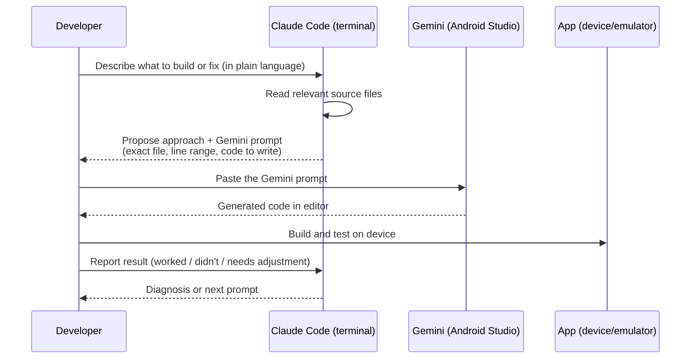

# AI-Assisted Development Workflow

SessionClick is built with a two-AI workflow. Claude Code handles architecture, planning, and code review. Gemini Code Assist handles in-IDE code generation. This article explains how the two tools divide responsibilities and how a typical session works.

## Why two AI tools

The two tools have complementary strengths:

|                      | Claude Code                                                                | Gemini Code Assist                              |
| -------------------- | -------------------------------------------------------------------------- | ----------------------------------------------- |
| **Where it runs**    | Terminal / CLI                                                             | Inside Android Studio                           |
| **What it can read** | Entire codebase, KB, blog, project docs                                    | Open files + surrounding context                |
| **Strength**         | Architecture, cross-file reasoning, writing precise prompts, documentation | Fast in-IDE code generation from a clear brief  |
| **Output**           | Plans, Gemini prompts, KB articles, blog posts                             | Actual code changes in the IDE                  |
| **Weakness**         | Not integrated into the IDE build loop                                     | Weaker at Oboe/NDK C++ and multi-file refactors |

The workflow turns these weaknesses into a non-issue: Claude does the reasoning, Gemini does the typing.

## The session workflow

A typical development session follows this pattern:

**The Gemini prompt format.** Claude prepares each prompt with:

- The file path and relevant line numbers
- The exact change to make (not "add a button" but "in `SongEditorSheet.kt` around line 45, replace the full-width `OutlinedTextField` with a `Row` containing…")
- Any dependencies to import
- What to look out for (e.g., "don't touch the outer `Column`'s padding")

This specificity is what makes Gemini reliable. Vague prompts produce vague code. Precise prompts with file names and line numbers produce code that compiles on the first try most of the time.

## What each tool actually writes

**Claude Code writes:**

- Gemini prompts (the primary output during coding sessions)
- KB articles (like this one)
- Blog post drafts
- Architecture documents
- Review feedback on Gemini-generated code

**Gemini Code Assist writes:**

- All Kotlin code in `composeApp/` and `shared/`
- CMakeLists changes and minor C++ additions
- Gradle and build file tweaks

**The developer writes:**

- Decisions (what to build and why)
- UI designs (mockups, layout sketches)
- App icon and store graphics (Affinity Designer, manually)
- Blog post edits and final review
- Test runs and device feedback

## Oboe / NDK exception

Gemini is weaker at C++ and Oboe-specific code. For audio engine work, the workflow shifts:

1. Claude Code reads the Oboe documentation and the existing `AudioEngine.cpp`.
2. Claude writes the C++ code directly (not as a Gemini prompt).
3. The developer pastes the code manually into `AudioEngine.cpp`.
4. Claude Code explains what to verify when testing.

## Project context files

Two files at the project root maintain persistent context for each tool:

- `GEMINI.md` — instructions for Gemini Code Assist: project structure, naming conventions, Compose patterns used in the project, what Gemini is allowed to change in a session.
- `CLAUDE.md` — instructions for Claude Code: architecture overview, decision log, what Claude should and shouldn't do in this project.

Both files are updated as the project evolves so that neither tool needs to re-learn conventions from scratch at the start of each session.

## Tool versions in use

| Tool               | Version / Plan                        |
| ------------------ | ------------------------------------- |
| Claude Code (CLI)  | claude-sonnet-4-6 (Sonnet 4.6 medium) |
| Gemini Code Assist | Free tier, built into Android Studio  |
| Android Studio     | Panda 3 (latest stable)               |

## Related articles

- [SessionClick App Architecture](../android/sessionclick-architecture.md) — the architecture that these tools produce
- [Tools overview](index.md)
